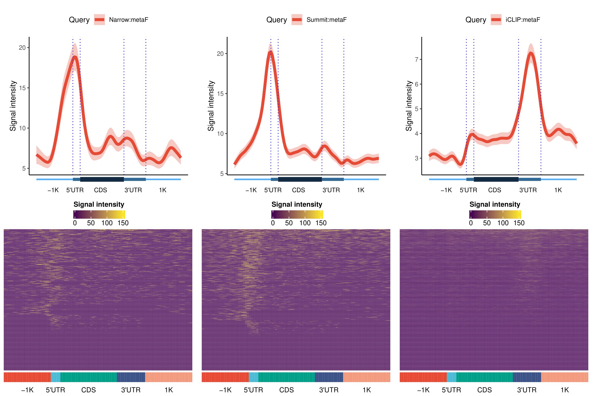
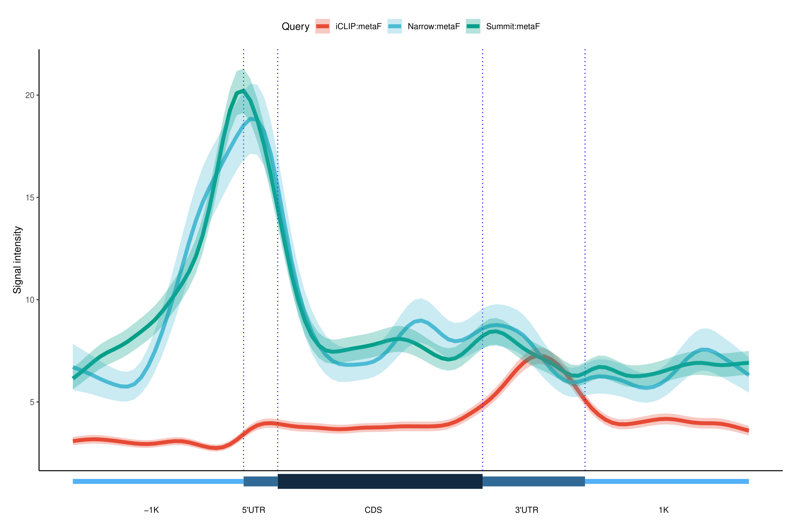

# GenomicPlot

<!-- badges: start -->
<!-- badges: end -->

The goal of GenomicPlot is to create an efficient visualization tool for next generation sequencing (NGS) data with rich functionality and flexibility. GenomicPlot enables plotting of NGS data in various formats (bam, bed, wig and bigwig); both coverage and enrichment over input can be computed and displayed with respect to genomic features (such as UTR, CDS, enhancer), and user defined genomic loci or regions. Statistical tests on signal intensity within user defined regions of interest can be performed and presented as box plots or pie charts. Parallel processing is enabled to speed up computation on multi-core platforms. In addition to genomic plots which is suitable for displaying of coverage of genomic DNA (such as ChIP-seq data), metagenomic (without introns) plots can also be made for RNA-seq or CLIP-seq data as well. For peak annotation, peaks targeting exonic and intronic regions of genomic features (5'UTR, CDS, 3'UTR) are counted separately.

## Installation

The following packages are prerequisites: 

GenomicRanges (>= 1.46.1), GenomicFeatures, Rsamtools, ggplot2 (>= 3.3.5), tidyr, rtracklayer (>= 1.54.0), plyranges (>= 1.14.0), dplyr (>= 1.0.8), cowplot (>= 1.1.1), VennDiagram, ggplotify, GenomeInfoDb, IRanges, ComplexHeatmap, RCAS (>= 1.20.0), scales (>= 1.2.0), GenomicAlignments (>= 1.30.0), edgeR, forcats, circlize, viridis, ggsignif (>= 0.6.3), ggsci (>= 2.9), genomation (>= 1.26.0), ggpubr

You can install the development version of GenomicPlot from [GitHub](https://github.com/) with:

``` r
# install.packages("devtools")
devtools::install_github("shuye2009/GenomicPlot")
```

## Examples

This is a basic example which shows you how to visualize your ChIP-seq peaks in different parts of genes, The resulting figure is 'test_plot_5parts_metagene.pdf'.

``` r

library(GenomicPlot)

txdb <- AnnotationDbi::loadDb(system.file("extdata", "txdb_chr19.sql", package="GenomicPlot"))
gf <- prepare_5parts_genomic_features(txdb, meta=TRUE, nbins=100, fiveP=1000, threeP=1000, longest=TRUE)

queryfiles <- c(system.file("extdata", "test_chip_peak_chr19.narrowPeak", package="GenomicPlot"),
                system.file("extdata", "test_chip_peak_chr19.bed", package="GenomicPlot"),
                system.file("extdata", "test_clip_peak_chr19.bed", package="GenomicPlot"))
names(queryfiles) <- c("Narrow", "Summit", "iCLIP")

op <- "test_plot_5parts_metagene"

handleInputParams <- list(CLIP_reads=FALSE, fix_width=100, fix_point="center", norm=TRUE, useScore=FALSE,
                          outRle=TRUE, useSizeFactor=FALSE, genome="hg19")

plot_5parts_metagene(queryFiles=queryfiles, 
                     gFeatures=list(metaF=gf), 
                     inputFiles=NULL, 
                     handleInputParams=handleInputParams,
                     verbose=FALSE, 
                     smooth=TRUE, 
                     scale=FALSE, 
                     stranded=TRUE, 
                     outPrefix=op, 
                     transform=FALSE, 
                     heatmap=TRUE,
                     rmOutlier=TRUE, 
                     heatRange=c(0,150),
                     nc=4)
                     
```

This example shows you how to visualize your iCLIP_peaks around ChIP-seq peaks. The resulting figure is 'test_plot_reference_locus.pdf'.





``` r

op <- "test_plot_reference_locus"

handleInputParams <- list(CLIP_reads=FALSE, fix_width=0, fix_point="center", norm=FALSE, useScore=FALSE,
                          outRle=TRUE, useSizeFactor=FALSE, genome="hg19")

plot_reference_locus(queryFiles=queryfiles[c(1,3)], 
                     centerFiles=queryfiles[2], 
                     ext=c(-500, 500), 
                     hl=c(-50, 50), 
                     inputFiles=NULL,                              
                     handleInputParams=handleInputParams, 
                     shade=TRUE, 
                     binSize=10, 
                     refPoint="center", 
                     Xlab="Summit",
                     verbose=FALSE, 
                     smooth=TRUE, 
                     scale=FALSE, 
                     stranded=TRUE, 
                     outPrefix=op, 
                     transform=FALSE, 
                     heatmap=TRUE,
                     rmOutlier=TRUE, 
                     nc=4)
                     
```

This example shows you how to annotate ChIP-seq peaks. The resulting figure is 'test_plot_peak_annotation.pdf', and the detailed annotation is in the table "summitPeak_targeted_annotated_gene.tab".

``` r

op <- "test_plot_peak_annotation"

gtffile <- system.file("extdata", "gencode.v19.annotation_chr19.gtf", package="GenomicPlot")

handleInputParams <- list(CLIP_reads=FALSE, fix_width=21, fix_point="center", norm=FALSE, useScore=FALSE,
                          outRle=FALSE, useSizeFactor=FALSE, genome="hg19")
                          
plot_peak_annotation(peakFile=queryfiles[2], 
                     gtfFile=gtffile, 
                     handleInputParams=handleInputParams, 
                     fiveP=1000, 
                     threeP=1000, 
                     outPrefix=op, 
                     verbose=FALSE)

```

For more examples, please check out the tests/test_output directory.

