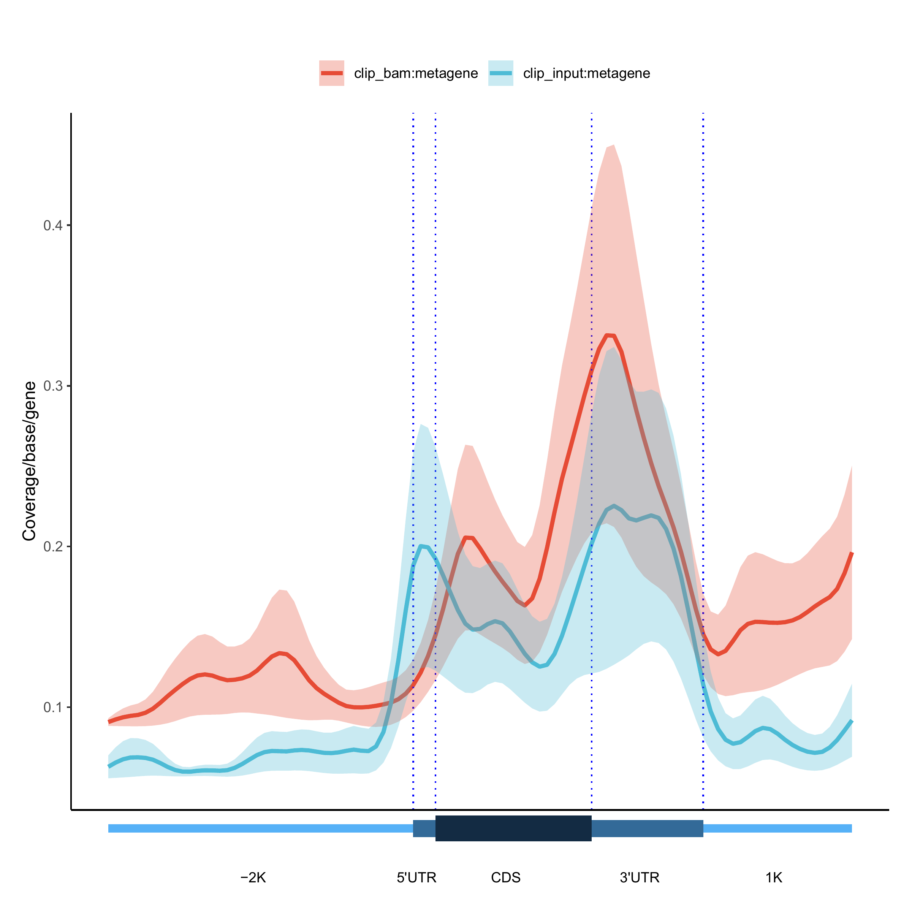
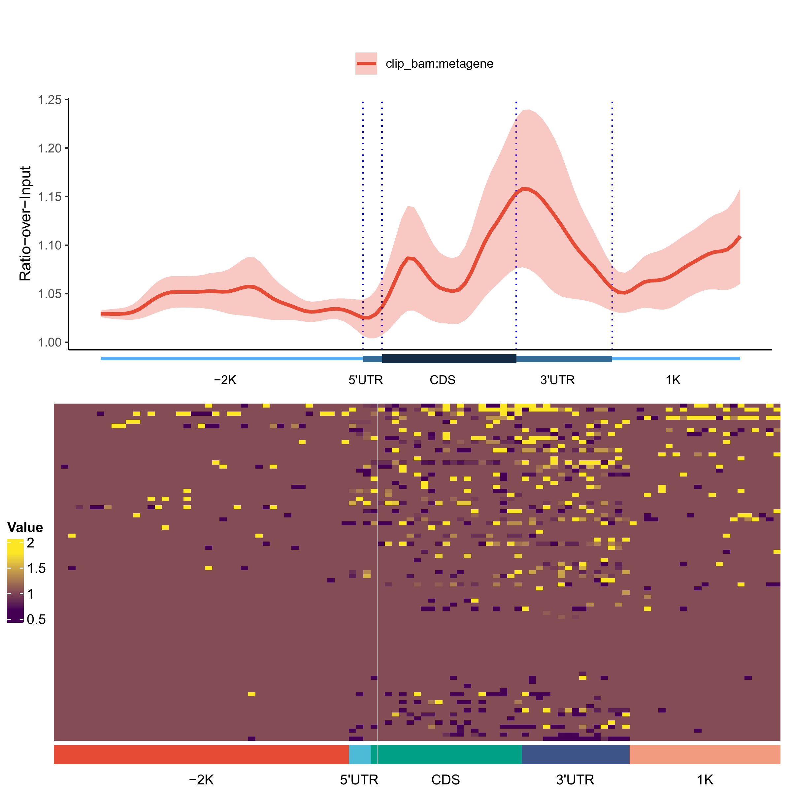
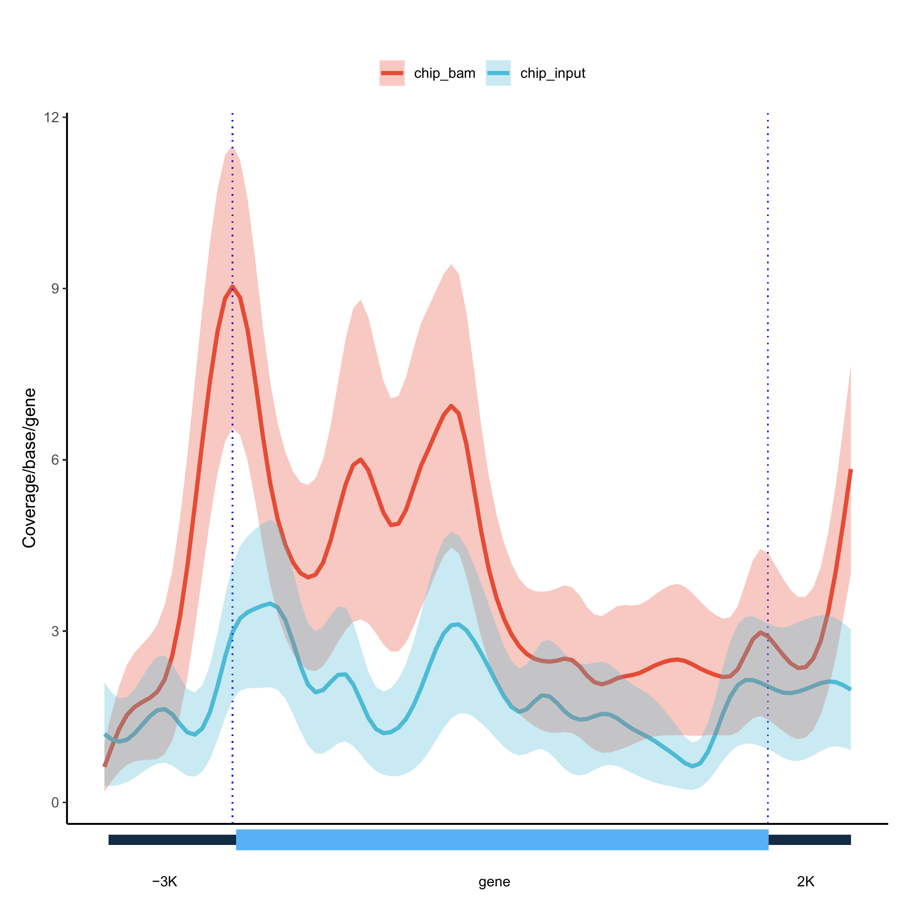
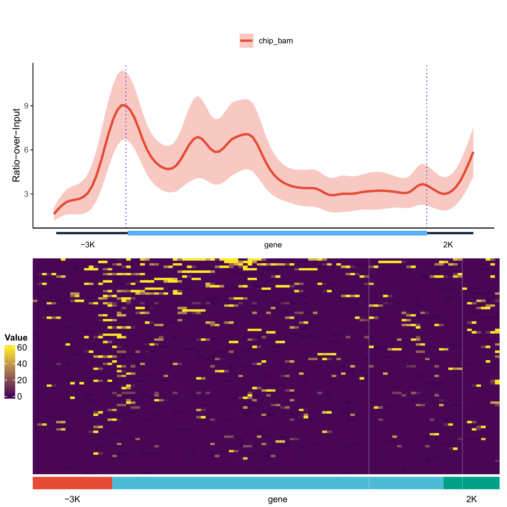
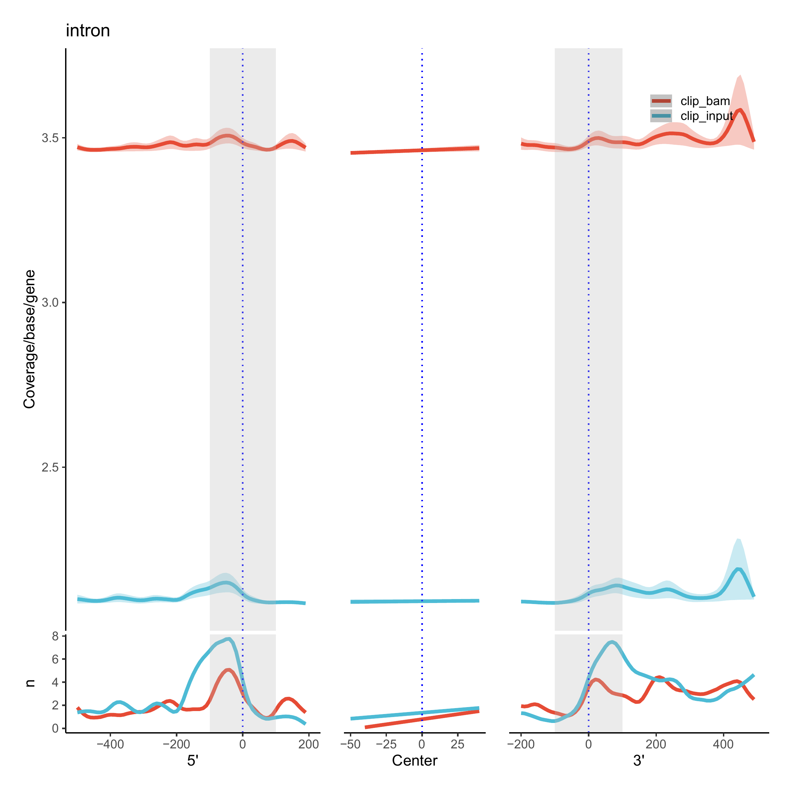
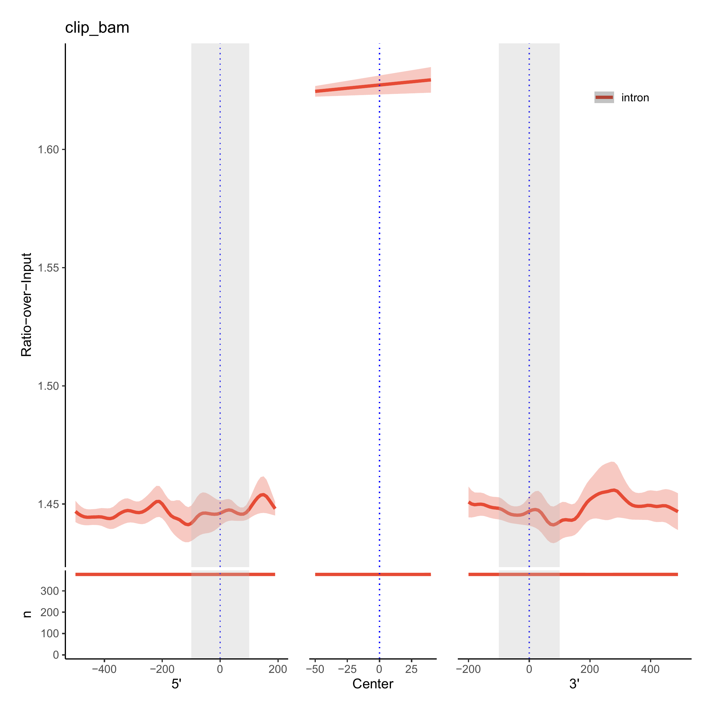
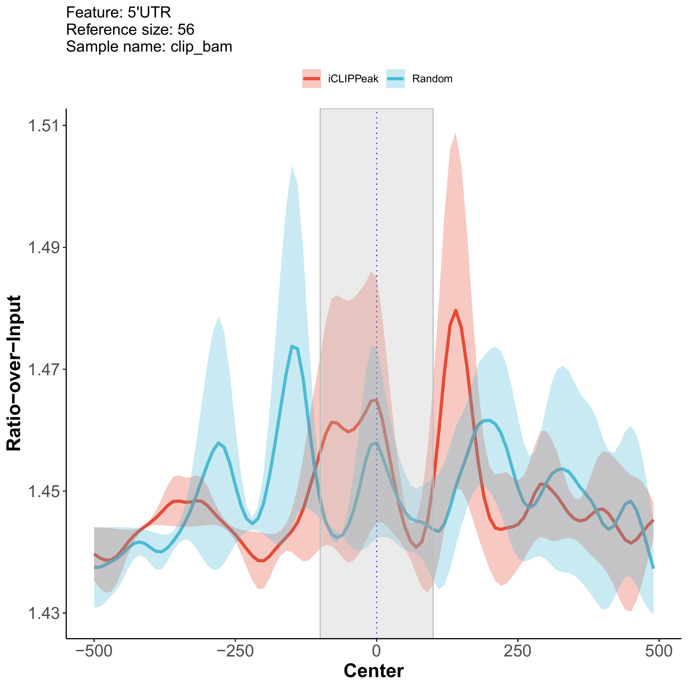
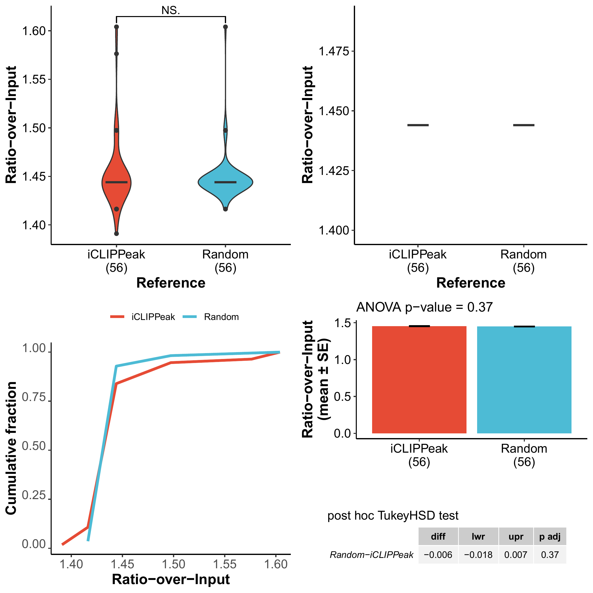

# Introduction{.unnumbered}

Visualization of next generation sequencing (NGS) data at various genomic features on a genome-wide scale provides an effective way of exploring and communicating experimental results on one hand, yet poses as a tremendous challenge on the other hand, due to the huge amount of data to be processed. Existing software tools like deeptools, ngs.plot, coverageView and metagene2, while having attractive features and perform reasonably well in relatively simple scenarios, like plotting coverage profiles of fixed genomic loci or regions, have serious limitations in terms of efficiency and flexibility. For instance, deeptools requires 3 steps (3 sub-programs to be run) to generate plots from input files: first, convert .bam files to .bigwig format; second, compute coverage matrix; and last, plot genomic profiles. Huge amount of intermediate data are generated along the way and additional efforts have to be made to integrate these 3 closely related steps. All of them focus on plotting signals within genomic regions or around genomic loci, but not within or around combinations of genomic features. None of them have the capability of performing statistical tests on the data displayed in the profile plots.

To meet the diverse needs of experimental biologists, we have developed GenomicPlot using rich resources available on the R platform (particularly, the Bioconductor). Our GenomicPlot has the following major features:

-   Generating genomic (with introns) or metagenomic (without introns) plots around gene body and its upstream and downstream regions, the gene body can be further segmented into 5' UTR, CDS and 3' UTR
-   Plotting genomic profiles around the start and end of genomic features (like exons or introns), or custom defined genomic regions
-   Plotting distance between sample peaks and genomic features, or distance from one set of peaks to another set of peaks
-   Plotting peak annotation statistics (distribution in different type of genes, and in different parts of genes)
-   Plotting peak overlaps as Venn diagrams
-   All profile line plots have error bands
-   Random features can be generated and plotted to serve as contrast to real features
-   Statistical analysis results on user defined regions are plotted along with the profile plots

# Installation{.unnumbered}

The following packages are prerequisites: 

GenomicRanges (>= 1.46.1), GenomicFeatures, Rsamtools, ggplot2 (>= 3.3.5), tidyr, rtracklayer (>= 1.54.0), plyranges (>= 1.14.0), dplyr (>= 1.0.8), cowplot (>= 1.1.1), VennDiagram, ggplotify, GenomeInfoDb, IRanges, ComplexHeatmap, RCAS (>= 1.20.0), scales (>= 1.2.0), GenomicAlignments (>= 1.30.0), edgeR, forcats, circlize, viridis, ggsignif (>= 0.6.3), ggsci (>= 2.9), genomation (>= 1.26.0), ggpubr

You can install the development version from `r Githubpkg("shuye2009/GenomicPlot", "GenomicPlot")` with:

```{r,  eval = FALSE}
# install.packages("remotes")
remotes::install_github("shuye2009/GenomicPlot", 
                        build_manual = TRUE, 
                        build_vignettes = TRUE)
```
Or download the source package from the latest release from `r Githubpkg("shuye2009/GenomicPlot", "GenomicPlot")` and run in R:

```{r,  eval = FALSE}
install.packages("path-to-source-package/GenomicPlot_x.x.x.tar.gz", 
                 repos = NULL)
```
where "path-to-source-package" is the absolute path to the file "GenomicPlot_x.x.x.tar.gz", substitute 'x' with the version number of your downloaded package.

# Core functions{.unnumbered}
## Plot gene/metagene with 5'UTR, CDS and 3'UTR

The lengths of each part of the genes are prorated based on the median length of 5'UTR, CDS and 3'UTR of protein-coding genes in the genome. The total length (including upstream and downstream extensions) are divided into the specified number of bins. Subsets of genes can be plotted as overlays for comparison. 

```{r, eval = FALSE, fig.show = 'hold', fig.keep = 'all', fig.align = 'center', fig.dim = c(7,7), fig.ncol=1, fig.sep="\n\n"}
library(GenomicPlot, quietly = TRUE)
gtffile <- system.file("extdata", "gencode.v19.annotation_chr19.gtf", 
                       package = "GenomicPlot")
gff <- RCAS::importGtf(saveObjectAsRds = TRUE, filePath = gtffile)
txdb <- makeTxDbFromGRanges(gff)

gf <- prepare_5parts_genomic_features(txdb,
  meta = TRUE, nbins = 100, fiveP = -2000, threeP = 1000,
  longest = TRUE
)

queryfiles <- system.file("extdata", "treat_chr19.bam", package = "GenomicPlot")
names(queryfiles) <- "clip_bam"
inputfiles <- system.file("extdata", "input_chr19.bam", package = "GenomicPlot")
names(inputfiles) <- "clip_input"

bamimportParams <- list(
  offset = -1, fix_width = 0, fix_point = "start", norm = TRUE,
  useScore = FALSE, outRle = TRUE, useSizeFactor = FALSE, genome = "hg19"
)

plot_5parts_metagene(
  queryFiles = queryfiles,
  gFeatures_list = list("metagene" = gf),
  inputFiles = inputfiles,
  scale = FALSE,
  verbose = FALSE,
  transform = NA,
  smooth = TRUE,
  stranded = TRUE,
  outPrefix = NULL,
  importParams = bamimportParams,
  heatmap = TRUE,
  rmOutlier = 0,
  nc = 5
)
```
```{r metagene2, echo = FALSE, fig.cap = "Profile overlay", fig.wide = TRUE}

```
```{r metagene3, echo = FALSE, fig.cap = "Ratio-over-input profile and heatmap", fig.wide = TRUE}

```


## Plot gene/metagene body

The lengths of each part of the profile plot are prorated to the lengths of upstream and downstream extensions as well as the median length of protein-coding genes in the genome. The total length (including upstream and downstream extensions) are divided into the specified number of bins.

```{r, eval = FALSE, fig.show = 'hold', fig.keep = 'all', fig.align = 'center', fig.dim = c(7,7)}

gf <- prepare_3parts_genomic_features(txdb,
  meta = FALSE, nbins = 100, fiveP = -3000, threeP = 2000,
  longest = TRUE
)

queryfiles <- system.file("extdata", "chip_treat_chr19.bam", 
                          package = "GenomicPlot")
names(queryfiles) <- "chip_bam"
inputfiles <- system.file("extdata", "chip_input_chr19.bam", 
                          package = "GenomicPlot")
names(inputfiles) <- "chip_input"

chipimportParams <- list(
  offset = 0, fix_width = 150, fix_point = "start", norm = TRUE,
  useScore = FALSE, outRle = TRUE, useSizeFactor = FALSE, genome = "hg19"
)

plot_3parts_metagene(
  queryFiles = queryfiles,
  gFeatures = gf,
  inputFiles = inputfiles,
  scale = FALSE,
  verbose = FALSE,
  transform = NA,
  smooth = TRUE,
  stranded = TRUE,
  outPrefix = NULL,
  importParams = chipimportParams,
  heatmap = TRUE,
  rmOutlier = 0,
  nc = 5
)
```
```{r gene2, echo = FALSE, fig.cap = "Profile overlay", fig.wide = TRUE}

```
```{r gene3, echo = FALSE, fig.cap = "Ratio-over-input profile and heatmap", fig.wide = TRUE}

```

## Plot along the ranges of genomic features

Signal profiles along with heatmaps in genomic features or user defined genomic regions provided through a .bed file or narrowPeak file can be plotted. Multiple samples (.bam files) and multiple set of regions (.bed file) can be overlayed on the same figure, or can be output as various combinations. When input files (for input samples) are available, ratio-over-input are displayed as well. Statistical comparisons between samples or between features can be plotted as boxplots or barplots of means`r knitr::asis_output("\U00B1")`SE.

```{r, eval = FALSE, fig.show = 'hold', fig.keep = 'all', fig.align = 'center', fig.dim = c(7,7)}
centerfiles <- system.file("extdata", "test_chip_peak_chr19.narrowPeak", 
                           package = "GenomicPlot")
names(centerfiles) <- c("NarrowPeak")
queryfiles <- c(
  system.file("extdata", "chip_treat_chr19.bam", package = "GenomicPlot")
)
names(queryfiles) <- c("chip_bam")
inputfiles <- c(
  system.file("extdata", "chip_input_chr19.bam", package = "GenomicPlot")
)
names(inputfiles) <- c("chip_input")

plot_region(
  queryFiles = queryfiles,
  centerFiles = centerfiles,
  inputFiles = inputfiles,
  nbins = 100,
  heatmap = TRUE,
  scale = FALSE,
  regionName = "narrowPeak",
  importParams = chipimportParams,
  verbose = FALSE,
  fiveP = -500,
  threeP = 500,
  smooth = TRUE,
  transform = NA,
  stranded = TRUE,
  outPrefix = NULL,
  rmOutlier = 0,
  nc = 5
)
```
```{r region5, echo = FALSE, fig.cap = "Ratio-over-input profile", fig.wide = TRUE}
knitr::include_graphics("../longtests/test_output/test_plot_region_4.png")
```

## Plot start, end and center of a genomic feature 

When the intron splicing sites are focus of studies, we want to inspect signals at both 5' splicing sites and 3' splicing sites, perhaps want to contrast with the center of introns as well, then displaying all 3 pieces of information in the same panel would be desirable.

```{r, eval = FALSE, fig.show = 'hold', fig.keep = 'all', fig.align = 'center', fig.dim = c(7,7)}

queryfiles <- system.file("extdata", "treat_chr19.bam", package = "GenomicPlot")
names(queryfiles) <- "clip_bam"
inputfiles <- system.file("extdata", "input_chr19.bam", package = "GenomicPlot")
names(inputfiles) <- "clip_input"
ext <- c(-500, 200, -200, 500)
hl <- c(-50, 50, -50, 50)

plot_start_end(
  queryFiles = queryfiles,
  inputFiles = inputfiles,
  txdb = txdb,
  centerFiles = "intron",
  binSize = 10,
  importParams = bamimportParams,
  ext = ext,
  hl = hl,
  insert = 100,
  stranded = TRUE,
  scale = FALSE,
  smooth = TRUE,
  outPrefix = NULL,
  nc = 5
)
```
```{r intron1, echo = FALSE, fig.cap = "Query and input sample profiles in start, center and end of intron", fig.wide = TRUE}

```
```{r intron2, echo = FALSE, fig.cap = "Ratio-over profile in start, center and end of intron", fig.wide = TRUE}

```

## Plot genomic loci (start, end or center of a feature)
Difference in signal intensity within specific regions around the reference loci can be tested, and the test statistics can be plotted as boxplot and barplot of mean +/- SE. The test can be done among loci or among samples.

```{r, eval = FALSE, fig.show = 'hold', fig.keep = 'all', fig.align = 'center', fig.dim = c(7,7)}
centerfiles <- c(
  system.file("extdata", "test_clip_peak_chr19.bed", package = "GenomicPlot"),
  system.file("extdata", "test_chip_peak_chr19.bed", package = "GenomicPlot")
)
names(centerfiles) <- c("iCLIPPeak", "SummitPeak")
queryfiles <- c(
  system.file("extdata", "chip_treat_chr19.bam", package = "GenomicPlot")
)
names(queryfiles) <- c("chip_bam")
inputfiles <- c(
  system.file("extdata", "chip_input_chr19.bam", package = "GenomicPlot")
)
names(inputfiles) <- c("chip_input")

plot_locus(
  queryFiles = queryfiles,
  centerFiles = centerfiles,
  ext = c(-500, 500),
  hl = c(-100, 100),
  shade = TRUE,
  smooth = TRUE,
  importParams = chipimportParams,
  binSize = 10,
  refPoint = "center",
  Xlab = "Center",
  inputFiles = inputfiles,
  stranded = TRUE,
  scale = FALSE,
  outPrefix = NULL,
  verbose = FALSE,
  transform = NA,
  rmOutlier = 0,
  statsMethod = "wilcox.test",
  heatmap = TRUE,
  nc = 5
)
```
```{r locus42, echo = FALSE, fig.cap = "Ratio-over-input profile around chip peaks and clip peaks", fig.wide = TRUE}
knitr::include_graphics("../longtests/test_output/test_plot_locus2_7.png")
```
```{r locus5, echo = FALSE, fig.cap = "Ratio-over-input stats around chip peaks and clip peaks", fig.wide = TRUE}
knitr::include_graphics("../longtests/test_output/test_plot_locus2_8.png")
```

## Plot genomic loci with random sites as contrast

Random sites that deviate from the reference loci within a specified maximum distance can be treated as a control, and the statistical tests will be performed between bona fide and the random sites. Here the reference sites located in different genomic features (5'UTR, CDS, 3'UTR) are tested separately. To avoid sampling bias, increase "n_random".

```{r, eval = FALSE, fig.show = 'hold', fig.keep = 'all', fig.align = 'center', fig.dim = c(7,7)}

centerfiles <- c(system.file("extdata", "test_clip_peak_chr19.bed", 
                             package = "GenomicPlot"))
names(centerfiles) <- c("iCLIPPeak")
queryfiles <- c(system.file("extdata", "treat_chr19.bam", 
                            package = "GenomicPlot"))
names(queryfiles) <- c("clip_bam")
inputfiles <- c(system.file("extdata", "input_chr19.bam", 
                            package = "GenomicPlot"))
names(inputfiles) <- c("clip_input")

plot_locus_with_random(
  queryFiles = queryfiles,
  centerFiles = centerfiles,
  txdb,
  ext = c(-500, 500),
  hl = c(-100, 100),
  shade = TRUE,
  importParams = bamimportParams,
  binSize = 10,
  refPoint = "center",
  Xlab = "Center",
  smooth = TRUE,
  inputFiles = inputfiles,
  stranded = TRUE,
  scale = FALSE,
  outPrefix = NULL,
  verbose = FALSE,
  transform = NA,
  rmOutlier = 0,
  n_random = 1,
  statsMethod = "wilcox.test",
  nc = 5
)
```
```{r locusr11, echo = FALSE, fig.cap = "Ratio-over-input for clip signal around clip peaks in 5'UTR", fig.wide = TRUE}

```
```{r locusr12, echo = FALSE, fig.cap = "Ratio-over-input for clip signal around clip peaks in 5'UTR", fig.wide = TRUE}

```

## Plot peak annotation statistics

Aside from reads coverage profiles, distribution of binding peaks in different gene types and genomic features is also important. Peak annotation statistics are plotted as bar chart for distribution in gene types, and as pie charts for distribution in genomic features. The pie charts are plotted in two different ways: either as percentage of absolute counts or as percentage of feature length-normalized counts in each features. For DNA binding samples, the features (in order of precedence) include "Promoter", "TTS", "5'UTR", "CDS", "3'UTR" and "Intron"; for RNA binding samples, "Promoter" and "TTS" are excluded. In the following example, "Promoter" is defined as regions 2000 bp upstream of transcription start site (TSS) and 300 bp downstream TSS, "TTS" is defined as the region 1000 bp downstream cleavage site or the length between cleavage site and the start of the next gene, whichever is shorter, but these lengths can be adjusted. To save annotation results (both peak-oriented and gene-oriented), set "verbose = TRUE".

```{r, eval = FALSE, fig.show = 'hold', fig.keep = 'all', fig.align = 'center', fig.dim = c(7,7)}
gtffile <- system.file("extdata", "gencode.v19.annotation_chr19.gtf", 
                       package = "GenomicPlot")

centerfile <- system.file("extdata", "test_chip_peak_chr19.bed", 
                          package = "GenomicPlot")
names(centerfile) <- c("SummitPeak")

bedimportParams <- list(
  offset = 0, fix_width = 100, fix_point = "center", norm = FALSE,
  useScore = FALSE, outRle = TRUE, useSizeFactor = FALSE, genome = "hg19"
)

pa <- plot_peak_annotation(
  peakFile = centerfile,
  gtfFile = gtffile,
  importParams = bedimportParams,
  fiveP = -2000,
  dsTSS = 300,
  threeP = 1000,
  simple = FALSE,
  verbose = TRUE,
  outPrefix = NULL
)
```
```{r annotation1, echo = FALSE, fig.cap = "Distribution of chip peak in various types of gene", fig.wide = TRUE}
knitr::include_graphics("../longtests/test_output/test_plot_peak_annotation1_1.png")
```
```{r annotation2, echo = FALSE, fig.cap = "Distribution of chip peak in various parts of gene", fig.wide = TRUE}
knitr::include_graphics("../longtests/test_output/test_plot_peak_annotation1_2.png")
```

# Appendix{.unnumbered}
## Session info{.unnumbered}

Here is the output of `sessionInfo()` on the system on which this document was
compiled:

```{r sessionInfo, echo=FALSE}
sessionInfo()
```


